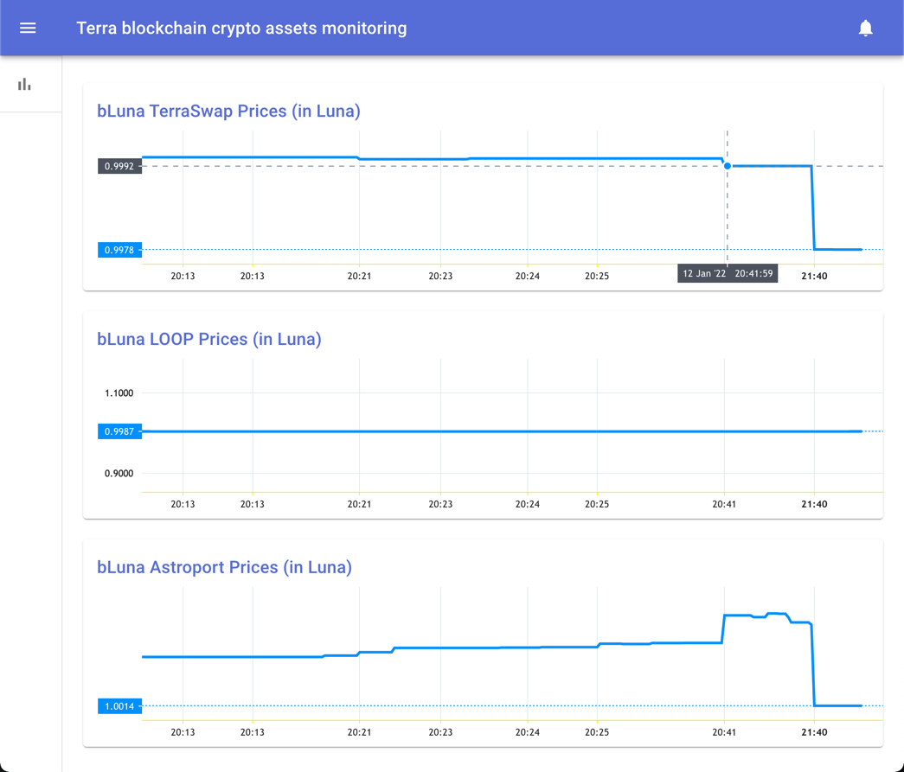
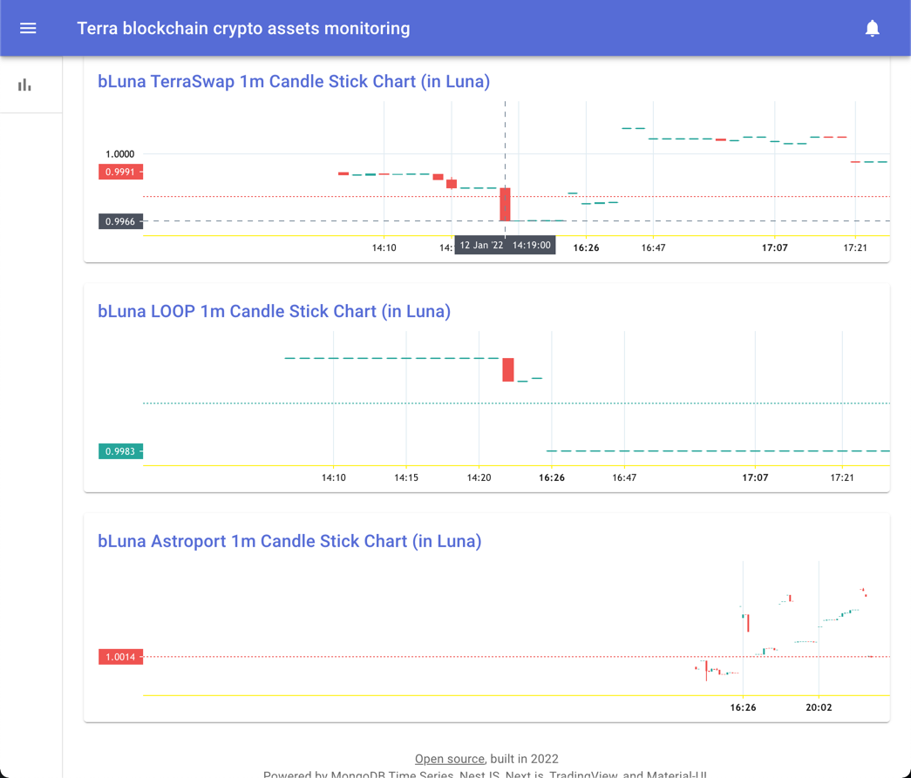

Problem
========
Terra Luna is an actively emerging blockchain focused on decentralized finance around stablecoins.
Terra's ecosystem is built around its native token, Luna. 
Bonded Luna or bLuna is another core coin in Terra Luna ecosystem being provided by Anchor Protocol and it trades (very)approximately 1:1 to Luna. Currently, there are three main decentralizes exchanges providing bLuna-Luna swap service.
Considering the difference in price and emerging exchanges, this gives arbitrage opportunities for traders.
There is no monitoring tool that allows to compare bLuna price on these exchanges in realtime.

Solution
==========
This simple single-page app shows bLuna price in Luna for all three exchanges as a price line as well as a 60s candle stick bar chart.
The solution is deployed and available at [http://46.148.238.135:3000/](http://46.148.238.135:3000/)

Approach
==========
The app utilizes MongoDB 5 Time Series processing, including monngo aggregation functions to select data and build candle stick chart.
On top of that the app is very basic and scalable, written in Typescript using Nest.js @ Node.js server and NextJs @ React frontend, the server utilizes Bull queue manager to poll the blockchain and populate MongoDB. 
Chart is built with MIT-licensed fast TradingView library.  
Single server performs both talks simultaneously or at least in stall-free mode (thanks to Bull) - serves the Next pages and populates the DB.

Installation
==========
Bull uses Redis to keep the queue, so you'd have to install Redis first. 
Mac: 
```bash
$ brew install redis
$ brew services start redis
```
Linux:
```bash
$ sudo add-apt-repository ppa:redislabs/redis
$ sudo apt-get update
$ sudo apt-get install redis
```
It's also possible on Win but I never tried.

Then clone the repo and install it normally.
```bash
$ yarn
```
or
```bash
$ npm install
```

Then, 
```bash
$ yarn start:dev
```
does the job serving the tool at
[http://localhost:3000](http://localhost:3000)

Usage
==========
That's pretty all of it. Responsive and scalable with mouse, trackpad or touchscreen.




## License
The app is [Apache 2.0 licensed](LICENSE).
